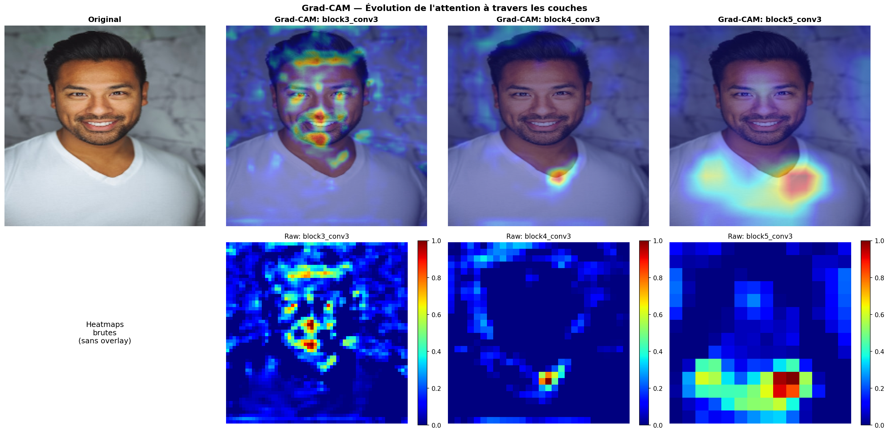
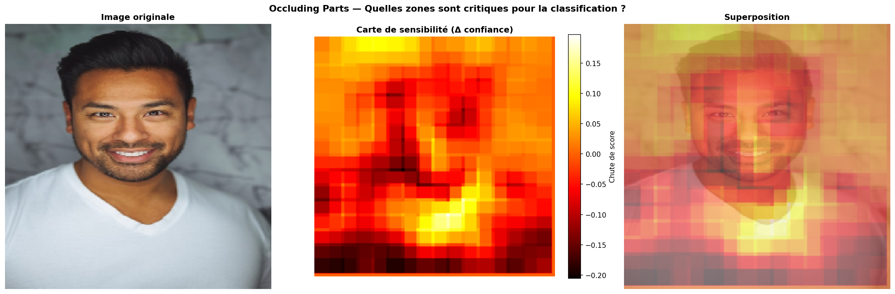
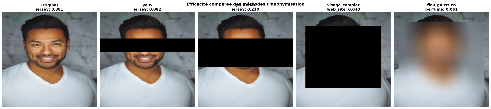

# 🧠 CNN Explainability Workshop

> **What do CNNs actually learn? And can we trust their decisions?**

[](https://python.org)
[](https://tensorflow.org)
[](LICENSE)

Deep neural networks are often called "black boxes" — they make predictions, but *why*? This project opens the box. Using **VGG16** (a 138-million-parameter image classifier), we investigate what a CNN actually learns, what it looks at when making a decision, and whether we can fool it with anonymization techniques.

This isn't just code that runs. It's an investigation — with quantitative evidence, critical analysis, and real-world implications for AI ethics and regulation.

---

## 🧭 The Big Picture

Imagine you have a neural network that can classify 1,000 types of objects in images. You show it a face. Three fundamental questions arise:

| Question | How we answer it | Part |
|----------|-----------------|:----:|
| **What _can_ it detect?** | Visualize the learned filters at different depths | 1 |
| **What _does_ it look at?** | Grad-CAM heatmaps + occlusion analysis | 2 |
| **Can we use it for faces?** | One-shot face recognition via transfer learning | 3 |
| **Can we ship it?** | Model export, optimization, GDPR compliance | 4 |

Each part builds on the previous one. Part 1 reveals the network's *capacity*, Part 2 shows how it *uses* that capacity, Part 3 *exploits* it for a new task, and Part 4 asks if this is *responsible*.

---

## Part 1 — What CNN Filters Detect

### The idea in simple terms

A CNN is made of stacked layers of "filters" — small pattern detectors. Early layers detect simple things (edges, colors). Deeper layers combine them into complex concepts (textures, shapes, faces). But we never *told* the network to learn edges — it figured it out on its own, just from millions of labeled images.

**How do we see what a filter has learned?** We start with a random noise image and iteratively modify it to *maximally activate* a specific filter. The result is the visual pattern that filter responds to most strongly — its "dream", in a sense.

### What we found


Three rows, three levels of abstraction:

| Layer | Depth | What filters detect | Biological analogy |
|-------|:-----:|--------------------|--------------------|
| `block1_conv2` | Shallow | Edges, gradients, color transitions | Simple cells in V1 cortex (Hubel & Wiesel, 1962) |
| `block3_conv3` | Middle | Textures, repetitive patterns, grids | Complex cells combining multiple orientations |
| `block5_conv3` | Deep | High-level structures, face-like shapes | Inferotemporal cortex specialized for object recognition |

This hierarchy **was not programmed** — it emerged purely from training on ImageNet. The network independently rediscovered principles of biological vision that neuroscientists identified in the 1960s.

### Going deeper: quantitative analysis

We don't just *look* at filters — we **measure** them:

- **Shannon entropy** — How complex is each filter's output? (Higher = richer patterns)
- **Inter-filter correlation** — Are filters actually different from each other? (Lower = more diverse representations)
- **Spatial variance** — Does the filter produce structured patterns or uniform noise?

**Key insight**: deeper layers have *higher entropy* (more complex patterns) but *lower correlation* (filters specialize and diversify). This is why transfer learning works — the network builds a rich, non-redundant feature space.

---

## Part 2 — Where the Network Actually Looks

### Grad-CAM: making decisions visible

When a neural network classifies an image, which pixels influenced that decision? **Grad-CAM** (Gradient-weighted Class Activation Mapping) answers this by tracing the gradients back to the last convolutional layers and producing a heatmap of "importance".

Think of it like asking the network: *"Show me what convinced you."*



**The surprising result**: the model predicts **"jersey"** (a type of clothing), not a face. Why? Because VGG16 was trained on ImageNet — a dataset of 1,000 object categories. It knows shirts, not people. The heatmap confirms this: the network focuses on the **shirt and neckline**, not facial features.

This reveals a critical principle: **interpretability depends on the training domain**. The same architecture, trained on different data, would look at completely different regions.

### ROI analysis: putting numbers on attention

We divided the face into 5 anatomical zones (forehead, eyes, nose, mouth, neck) and measured Grad-CAM activation in each zone across 3 layers. This gives us a **quantitative map** of where the network directs its attention — not just a visual impression.

### Occlusion sensitivity: a second opinion

Grad-CAM uses gradients (what the network *could* change). Occlusion analysis uses something more direct: we **physically block** parts of the image with a gray patch and measure how much the prediction confidence drops.



Where Grad-CAM says *"this area contributed to the decision"*, occlusion says *"without this area, the decision changes"*. When both methods agree, we have strong evidence.

| Method | What it measures | Speed | Reliability |
|--------|-----------------|:-----:|:-----------:|
| **Grad-CAM** | Gradient-based importance | Fast (1 pass) | Can miss redundant features |
| **Occlusion** | Actual impact when removed | Slow (N² passes) | Model-agnostic ground truth |

---

## Part 2b — Challenging CNIL Anonymization Guidelines

### The experiment

The French data protection authority (CNIL) recommends **masking the eyes** to anonymize faces. But is that enough to fool a modern CNN?

We tested 4 anonymization strategies with increasing coverage and measured the actual confidence drop on VGG16:



### The actual numbers

| Method | Predicted class | Confidence | Drop vs. original | Same class? |
|--------|:--------------:|:----------:|:-----------------:|:-----------:|
| **Original** (no mask) | jersey | **38.1%** | — | — |
| **Eyes only** | jersey | 8.2% | **−78.4%** | ✅ Yes |
| **Eyes + Nose** | jersey | 23.0% | −39.8% | ✅ Yes |
| **Full face** | web_site | 4.0% | −89.6% | ❌ No |
| **Gaussian blur** | perfume | 6.1% | −84.0% | ❌ No |

### What do these numbers actually tell us?

Let's be intellectually honest — the results are **more nuanced** than a simple "eye masking fails":

1. **Eye masking _does_ reduce confidence significantly** — from 38.1% down to 8.2%, a 78% drop. That's not nothing. The mask clearly disrupts the network's ability to make a confident prediction.

2. **But the predicted class doesn't change.** The model still says "jersey." It adapted — instead of using the whole face+body combination, it relied more heavily on clothing texture, skin tone, and body shape. The identity of the prediction survived the masking.

3. **Eyes + Nose is paradoxically _less_ effective** than eyes alone (23% confidence vs 8.2%). This is counterintuitive. A possible explanation: masking a larger contiguous area creates a strong contrast edge that the CNN treats as a new feature (a "rectangle on a shirt"), which accidentally *reinforces* the clothing classification.

4. **Only full-face and blur force a class change** — and even then, the replacement classes ("web_site", "perfume") are nonsensical, meaning the model is truly confused, not just less confident.

### The takeaway

The CNIL guideline of masking the eyes was designed for **human perception** — a person can't recognize a face without seeing the eyes. But CNNs don't "see" like humans. They use **statistical texture patterns** across the entire image: skin color distribution, jawline contour, hair texture, clothing patterns. Masking 14% of the image (the eye region) leaves 86% of exploitable features intact.

This has real-world implications: anonymization guidelines designed for humans may not protect against algorithmic re-identification. Moreover, research suggests this problem is **ethnically biased** — face recognition systems perform differently across demographic groups, and anonymization effectiveness varies with skin tone and facial structure (Shrutin et al., 2019).

---

## Part 3 — One-Shot Face Recognition

### The challenge

Can we build a face recognition system with **just one photo per person**? Traditional deep learning needs thousands of examples. With one sample, classical training is impossible.

### The solution: transfer learning + KNN

Instead of training a new network, we **reuse** VGG16 as a feature extractor. The deep layers of VGG16 (trained on millions of images) produce a 25,088-dimensional "fingerprint" for any input image. We then use a simple **K-Nearest Neighbors** classifier to match faces based on these fingerprints.

Why KNN instead of a neural network?

| Approach | Training data needed | Accuracy with 1 sample | Explainability |
|----------|:-------------------:|:---------------------:|:--------------:|
| Neural Network | Thousands | ❌ Impossible | Low |
| KNN + Transfer Learning | **1 per person** | ✅ Works | High (distance-based) |

This is an elegant demonstration of the **build vs. reuse** principle in ML: sometimes the smartest solution is to leverage existing knowledge rather than starting from scratch.

---

## Part 4 — Production & Ethics

### Model export

The feature extractor is exported as a **TensorFlow SavedModel** (~112 MB), ready for deployment. In production, the full 138M-parameter model would need optimization:

| Constraint | Raw VGG16 | After optimization |
|------------|:---------:|:------------------:|
| Size | 528 MB | ~130 MB (quantized) |
| Inference | ~50 ms/image | ~15 ms (TF-Lite) |
| GDPR | ⚠️ Stores biometric data | ✅ On-device processing |

### Ethical considerations

Facial embeddings are **biometric data** under GDPR (Article 9). Any production system must address consent, storage, and the right to be forgotten. This project demonstrates the technical pipeline — but deploying it responsibly requires legal and ethical safeguards beyond the code.

---

## Methodology

Every claim in this project is backed by **quantitative evidence**, not just visual inspection:

| Analysis | Method | Why it matters |
|----------|--------|----------------|
| Filter diversity | Shannon entropy + inter-filter correlation | Proves filters learn *different* features, not redundant ones |
| Attention mapping | ROI analysis (5 zones × 3 layers) | Quantifies *where* the network looks, not just visually |
| Occlusion sensitivity | Sliding patch with confidence δ | Model-agnostic validation of Grad-CAM findings |
| Anonymization efficacy | 4 methods, confidence measured | Experimental challenge of CNIL regulatory guidelines |

---

## Quick Start

```bash
# Requires uv (https://github.com/astral-sh/uv)
uv sync
uv run jupyter lab
```

Open `TP_Reconnaissance_Faciale.ipynb` and **Run All** (~8 min on CPU).

## Project Structure

```
├── TP_Reconnaissance_Faciale.ipynb   ← Main notebook (run this)
├── test_face.jpg                     ← Test portrait image
├── output_figures/                   ← Generated visualizations
│   ├── 01_filters.png
│   ├── 02_gradcam.png
│   ├── 03_occlusion.png
│   └── 04_cnil_mask.png
├── pyproject.toml                    ← Dependencies (uv)
└── README.md
```

## Tech Stack

Python 3.11 · TensorFlow 2.20 · OpenCV · scikit-learn · Matplotlib
Package manager: [uv](https://github.com/astral-sh/uv)

## References

- Selvaraju et al. (2017) — [Grad-CAM: Visual Explanations from Deep Networks](https://arxiv.org/abs/1610.02391)
- Yosinski et al. (2014) — [How transferable are features in deep neural networks?](https://arxiv.org/abs/1411.1792)
- Shrutin et al. (2019) — [Deep Learning for Face Recognition: Pride or Prejudiced?](https://arxiv.org/abs/1904.01219)
- Hubel & Wiesel (1962) — Receptive fields in the cat's striate cortex
- Keras tutorials: [Filter visualization](https://keras.io/examples/vision/visualizing_what_convnets_learn/) · [Grad-CAM](https://keras.io/examples/vision/grad_cam/)

## License

MIT
