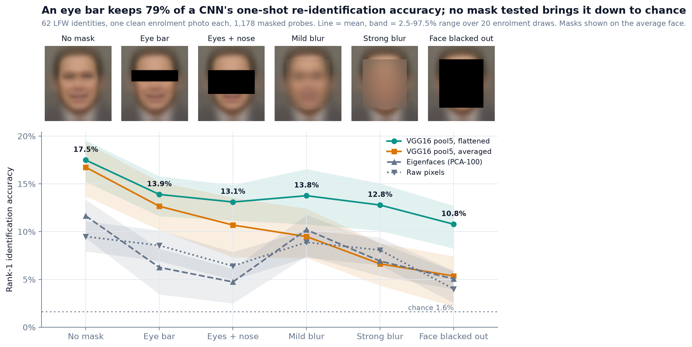
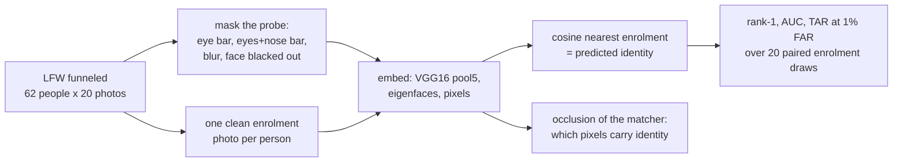
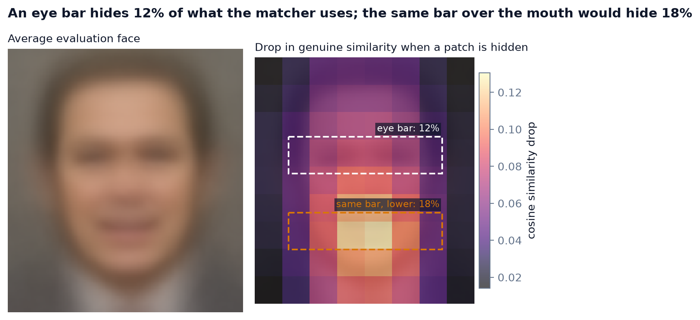
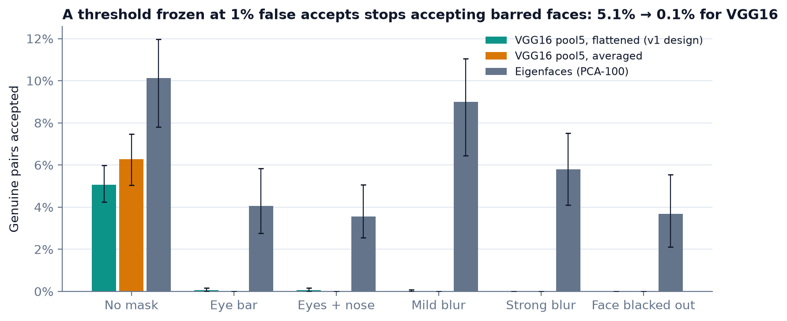
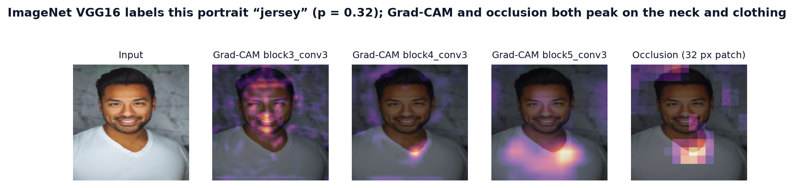
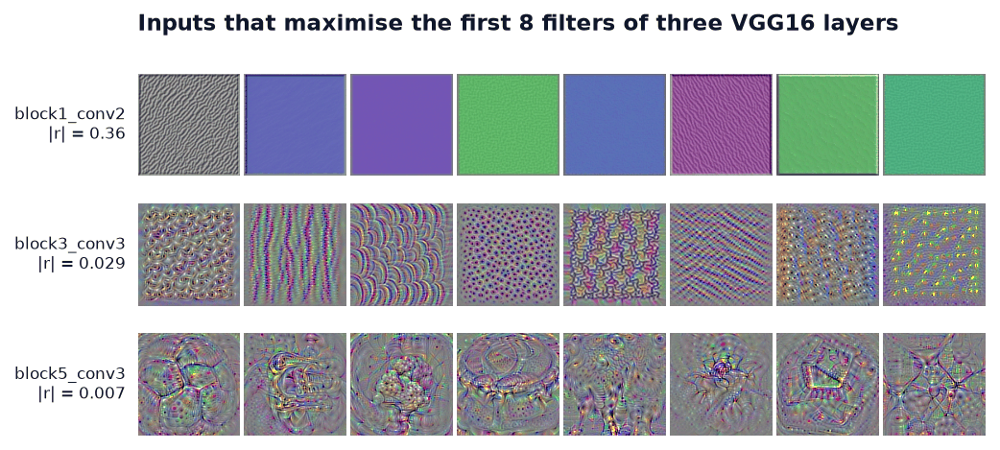

# cnn-explainability-workshop

Does a black bar over the eyes stop a CNN from recognising a face? A one-shot re-identification test on 62 LFW identities, with occlusion, Grad-CAM and feature visualisation to show why the answer is no.

[](https://github.com/Pchambet/cnn-explainability-workshop/actions/workflows/ci.yml)
[](.python-version)
[](LICENSE)
[](https://pchambet.github.io/cnn-explainability-workshop/)



## TL;DR

- **The eye bar dents re-identification, it does not stop it.** With one clean enrolment photo per person, an off-the-shelf ImageNet VGG16 names the right person for 17.5% of unmasked probes among 62 identities (chance 1.6%) and 13.9% of eye-barred ones: 79% of its accuracy survives, 8.6× chance.
- **A free counter-move cancels it.** If the attacker draws the same bar on the enrolment photo, eye-barred probes are re-identified at 17.2% (flattened features) and 18.4% (averaged features).
- **What the bar does break is a fixed threshold.** It lowers every similarity score, so a verifier frozen at a 1% false-accept rate goes from accepting 5.1% of genuine pairs to 0.1%. Ranking, which is what an attacker uses, is barely affected (AUC 0.69 → 0.67).
- **Why:** occlusion on the matcher puts 12% of its sensitivity in the eye band, which covers 10% of the image: about its fair share. The same bar moved down over the mouth would hide 18%.
- **The first version of this workshop measured the wrong thing** (an ImageNet label's confidence on one masked portrait, not identity); the experiment above replaces it.

## Why it matters

Eye bars and blurs are still used to publish faces "anonymously": in press photos, image datasets, internal reports. The CNIL's innovation lab warns that an eye bar alone "may be ineffective against a facial recognition algorithm, which could find enough markers on the face to identify the person" ([LINC, 2023](https://linc.cnil.fr/protection-des-temoins-casser-la-voix-et-limage)). Before choosing an obfuscation, it is worth knowing how much identity it removes against a realistic attacker who holds one ordinary photo of each candidate. This repository measures that for a generic CNN and explains the result with three interpretability methods.

## Approach


```mermaid
flowchart LR
    A[LFW funneled<br/>62 people x 20 photos] --> B[mask the probe:<br/>eye bar, eyes+nose bar,<br/>blur, face blacked out]
    A --> C[one clean enrolment<br/>photo per person]
    B --> D[embed: VGG16 pool5,<br/>eigenfaces, pixels]
    C --> D
    D --> E[cosine nearest enrolment<br/>= predicted identity]
    E --> F[rank-1, AUC, TAR at 1% FAR<br/>over 20 paired enrolment draws]
    D --> G[occlusion of the matcher:<br/>which pixels carry identity]
```

1. **Data.** [Labeled Faces in the Wild](http://vis-www.cs.umass.edu/lfw/), funneled (aligned by congealing, Huang, Jain & Learned-Miller 2007). The 62 people with at least 20 photos, first 20 photos each (1,240 images); crop with hair, ears and collar.
2. **Attack.** For each of 20 random draws, enrol one clean photo per person and match each of the 1,178 other photos, masked, to the nearest enrolled photo. All masks share the same draws, so comparisons between masks are paired.
3. **Matchers.** VGG16 pool5 flattened (25,088-d, the design of the first version) or averaged (512-d); eigenfaces (PCA-100) fitted on 96 *other* LFW identities; raw grey pixels.
4. **Explain.** Occlusion maps of the matcher's genuine similarity, averaged over the aligned faces; Grad-CAM, occlusion and activation maximisation on one portrait.

## Results

**Re-identification by mask.** Rank-1 accuracy, mean over 20 enrolment draws, [2.5%, 97.5%] range of the draws.

| Matcher | No mask | Eye bar | Eyes + nose | Mild blur | Strong blur | Face blacked out |
|---|--:|--:|--:|--:|--:|--:|
| VGG16 pool5, flattened | **17.5%** [15%, 20%] | **13.9%** [12%, 16%] | 13.1% [11%, 15%] | 13.8% [11%, 17%] | 12.8% [10%, 15%] | 10.8% [8%, 13%] |
| VGG16 pool5, averaged | 16.7% [14%, 19%] | 12.7% [10%, 15%] | 10.7% [7%, 14%] | 9.5% [7%, 12%] | 6.6% [4%, 9%] | 5.4% [2%, 7%] |
| Eigenfaces (PCA-100) | 11.6% [9%, 13%] | 6.3% [3%, 8%] | 4.7% [2%, 6%] | 10.2% [7%, 12%] | 6.9% [5%, 9%] | 5.1% [4%, 6%] |
| Raw pixels | 9.5% [8%, 11%] | 8.6% [7%, 10%] | 6.4% [5%, 8%] | 8.9% [7%, 10%] | 8.1% [6%, 9%] | 4.0% [3%, 6%] |

Every mask leaves the flattened VGG16 matcher well above chance (1.6%), including a blacked-out face (10.8%, 6.7× chance): hair, face outline, collar and the photo itself still carry identity. Keeping the spatial layout (flattened) makes the matcher markedly more robust to blur than averaging it away.

**Masking the enrolment photo too.** Rank-1 accuracy when the attacker applies the same mask to the enrolment photos.

| Attacker | No mask | Eye bar | Eyes + nose | Mild blur | Strong blur | Face blacked out |
|---|--:|--:|--:|--:|--:|--:|
| VGG16 flattened, clean enrolment | 17.5% | 13.9% | 13.1% | 13.8% | 12.8% | 10.8% |
| VGG16 flattened, masked enrolment | 17.5% | **17.2%** | 16.2% | 17.3% | 15.7% | 13.5% |
| VGG16 averaged, clean enrolment | 16.7% | 12.7% | 10.7% | 9.5% | 6.6% | 5.4% |
| VGG16 averaged, masked enrolment | 16.7% | **18.4%** | 16.5% | 15.4% | 14.5% | 11.0% |
| Eigenfaces, clean enrolment | 11.6% | 6.3% | 4.7% | 10.2% | 6.9% | 5.1% |
| Eigenfaces, masked enrolment | 11.6% | 7.7% | 7.3% | 9.9% | 8.2% | 7.0% |

Most of what the bar removes is a mismatch between probe and reference, not identity: once both photos carry the bar, the CNN matchers are back at (flattened, 17.2% vs 17.5%) or above (averaged, 18.4% vs 16.7%) their unmasked accuracy. Matching the mask helps the CNNs under every mask; it helps eigenfaces much less (and not at all under the mild blur).

**Where the matcher looks.**



Hiding a 40 × 40 px patch of the probe and measuring the drop in similarity to the enrolled photo, averaged over the 62 aligned identities: the eye band holds 12% of the sensitivity for 10% of the image, about its fair share, and the peak sits just below the nose. Sliding a box of the eye bar's size down the face, it would hide at most 18% (over the mouth and chin) and at least 10% (over the forehead). The eyes are not where this matcher concentrates its evidence, so a bar there removes little that the rest of the face cannot make up for.

**Verification collapses under a frozen threshold.**



With a threshold calibrated on unmasked photos at a 1% false-accept rate and then frozen, the VGG16 matchers accept almost no barred genuine pair (5.1% → 0.1%), because the bar lowers every similarity score, impostors included. That is a calibration effect, not anonymity: ranking is barely affected (AUC 0.69 → 0.67) and an attacker recalibrates. Unmasked, eigenfaces are the better verifier at this operating point (10.1% vs 5.1%) even though the CNN is the better identifier. The first version's fixed threshold of 0.5 accepted 26% of genuine pairs and 10.6% of impostors.

**What an ImageNet CNN sees in a portrait.**



VGG16 knows 1,000 ImageNet classes and no identities, so on a portrait it predicts an object: "loupe" (p = 0.21). Grad-CAM at block5 and occlusion both peak on the round metal neck ring of the spacesuit, not on the face; block3 Grad-CAM follows edges (hair outline, ring, background). Occlusion is not monotone here: on 76% of the image, the patches covering a pixel *raise* p(loupe) on average (median change +0.04, up to +0.27 on a base of 0.21), a reminder that a single-image map is an illustration, not evidence. Grad-CAM uses the pre-softmax class score, as in Selvaraju et al. The portrait is the public-domain NASA photograph of astronaut Eileen Collins (`skimage.data.astronaut`), cropped to head and shoulders.



Activation maximisation (gradient ascent on the input, pre-ReLU objective) shows colours and oriented edges in block1, repeating textures in block3 and object parts in block5. The visualisations of 16 filters per layer become less correlated pixel by pixel with depth (mean |r| 0.36 → 0.029 → 0.007). That describes the images, not the filters: near-uniform colour fields correlate through their shared colour balance and high-frequency textures hardly correlate at all, so it is not a measure of functional redundancy. 89% of VGG16's 138.4 M parameters sit in the three dense layers that the matcher discards.

**The first version's measurement, for the record.** It masked a portrait and read the drop in its top ImageNet probability ("jersey", 0.381 → 0.082 under the eye bar) as proof that the bar fails against CNNs. That portrait had no traceable source or licence and was replaced. Repeated on the new one, the same measurement goes the other way:

| Portrait | ImageNet top-1 | p(top-1) |
|---|---|--:|
| No mask | loupe | 0.207 |
| Eye bar | loupe | 0.452 |
| Eyes + nose | loupe | 0.621 |
| Mild blur | loupe | 0.559 |
| Strong blur | loupe | 0.647 |
| Face blacked out | loupe | 0.649 |

Hiding the face makes VGG16 *more* confident in an object it sees in the spacesuit. These numbers describe an object classifier's confidence; they cannot say whether the person is still recognisable.

**Cost.** VGG16 has 138.4 M parameters (553 MB of float32 weights); the pool5 extractor keeps 14.7 M (59 MB). On the laptop CPU used here (3 TensorFlow threads, other jobs running, load average 10-21 on 10 cores), the best of 30 single-image runs took 422 ms for the classifier and 221 ms for the extractor, and the best of 5 batches of 32 took 294-310 ms per image; medians were higher and unstable, so these are upper bounds for this machine, not a benchmark (raw numbers in [`results/latency.json`](results/latency.json)). Quantisation and TF-Lite were not tried.

## Corrections to the first version

| First version claimed | What the code now measures |
|---|---|
| Masking the eyes "fails" against CNNs, shown by the ImageNet "jersey" confidence | Re-identification on LFW, with enrolment and masked probes (above) |
| One-shot recognition "works", shown by an image matching itself (similarity 1.0) | Rank-1 17.5% on 62 identities, chance 1.6% |
| Threshold 0.5 rejects unknown faces | At 0.5 the matcher accepts 26% of genuine pairs and 10.6% of impostors |
| Latency ~50 ms, ~15 ms after TF-Lite; 130 MB quantised | Measured on CPU (above); quantisation not done, so no number is given |
| Deep filters visualised (they were noise) | Fixed preprocessing and pre-ReLU objective; block5 now shows object parts |
| "Shrutin et al. (2019)" | Nagpal, Singh, Singh, Vatsa (2019) |
| Portrait of unknown source and licence | Public-domain NASA portrait (`skimage.data.astronaut`) |

## Reproduce

```bash
make setup     # uv sync --locked (Python 3.12, TensorFlow CPU)
make data      # LFW funneled, ~230 MB, checksum-verified, cached in data/raw/
make run       # all experiments -> results/ ; roughly 1-2 h on a laptop CPU (3 threads)
make report    # figures -> docs/figures/, report -> site/index.html
make test lint
```

VGG16 ImageNet weights (~530 MB) are downloaded by Keras on first use. Disk: ~1.3 GB including the embedding cache in `data/interim/` (safe to delete). The walkthrough notebook ([`notebooks/walkthrough.ipynb`](notebooks/walkthrough.ipynb), [open in Colab](https://colab.research.google.com/github/Pchambet/cnn-explainability-workshop/blob/main/notebooks/walkthrough.ipynb)) runs the methods interactively on the portrait.

## Repository layout

```
src/cnn_explainability/
  lfw.py           download (checksum) and balanced subset loader
  masks.py         eye bar, eyes+nose bar, blur, face box on fractional boxes
  vgg.py           VGG16 loading, preprocessing, pool5 embeddings
  explain.py       activation maximisation, Grad-CAM, batched model-agnostic occlusion
  recognition.py   one-shot split, rank-1, ROC AUC, TAR at FAR, frozen thresholds
  pipeline.py      the three experiments -> results/
  figures.py       static figures; report.py + report_template.html -> site/
  cli.py           cnn-xai data | run | report
tests/             unit tests on hand-checked cases and known-answer models
results/           small result files used by the README and the report
docs/figures/      figures
notebooks/         walkthrough
assets/portrait.jpg  public-domain NASA portrait (source in assets/README.md)
```

## Methodology notes and limitations

- **A generic CNN, not a face recogniser.** VGG16 was trained on ImageNet objects; it is a weak face matcher (rank-1 17.5%). A dedicated model such as ArcFace would be much stronger; whether it relies more or less on the eyes was not tested here, so the numbers say what a low-effort attacker achieves, not an upper bound.
- **Eigenfaces lose to the CNN** on clean photos (11.6% vs 17.5%) and pixels do worse (9.5%); they are fitted on disjoint identities, so none of the matchers saw the evaluation people.
- **LFW is news photography of public figures.** Photos of one person often come from the same event, so background and clothing help the matcher. That is realistic for an attacker, but it means "identity" here partly includes context, which also explains why accuracy stays above chance when the face is blacked out.
- **Masks are fixed boxes** on aligned faces, placed from the average face (see the hero figure). Real bars are drawn per photo.
- **Intervals** are the spread over enrolment draws; they do not capture sampling of identities (62 is small).
- **Portrait explanations are illustrations**, one image, not evidence. Grad-CAM and occlusion are sensitive to layer choice and patch size.
- **Latency** was measured on a shared laptop under heavy load (load average reported in `results/latency.json`): treat it as an upper bound for that machine.

## References

- Huang, Ramesh, Berg, Learned-Miller (2007). *Labeled Faces in the Wild: A Database for Studying Face Recognition in Unconstrained Environments.* UMass Amherst TR 07-49. Data: [vis-www.cs.umass.edu/lfw](http://vis-www.cs.umass.edu/lfw/), funneled release `lfw-funneled.tgz` (mirror used by scikit-learn).
- Huang, Jain, Learned-Miller (2007). *Unsupervised Joint Alignment of Complex Images.* ICCV. The alignment (funneling) applied to the LFW images used here.
- Simonyan, Zisserman (2015). *Very Deep Convolutional Networks for Large-Scale Image Recognition.* ICLR. [arXiv:1409.1556](https://arxiv.org/abs/1409.1556)
- Selvaraju et al. (2017). *Grad-CAM: Visual Explanations from Deep Networks via Gradient-based Localization.* ICCV. [arXiv:1610.02391](https://arxiv.org/abs/1610.02391)
- Zeiler, Fergus (2014). *Visualizing and Understanding Convolutional Networks.* ECCV. [arXiv:1311.2901](https://arxiv.org/abs/1311.2901)
- Turk, Pentland (1991). *Eigenfaces for Recognition.* Journal of Cognitive Neuroscience 3(1).
- McPherson, Shokri, Shmatikov (2016). *Defeating Image Obfuscation with Deep Learning.* [arXiv:1609.00408](https://arxiv.org/abs/1609.00408)
- Nagpal, Singh, Singh, Vatsa (2019). *Deep Learning for Face Recognition: Pride or Prejudiced?* [arXiv:1904.01219](https://arxiv.org/abs/1904.01219)
- CNIL LINC, Biéri & Léautier (2023). [*Protection des témoins : casser la voix et l'image*](https://linc.cnil.fr/protection-des-temoins-casser-la-voix-et-limage).
- Portrait: Eileen Collins, NASA official portrait, public domain, as distributed with scikit-image ([`skimage.data.astronaut`](https://scikit-image.org/docs/stable/api/skimage.data.html#skimage.data.astronaut)).
- Keras examples: [visualising what convnets learn](https://keras.io/examples/vision/visualizing_what_convnets_learn/), [Grad-CAM](https://keras.io/examples/vision/grad_cam/).

---

Built by [Pierre Chambet](https://github.com/Pchambet) — decision science for operations under uncertainty.
